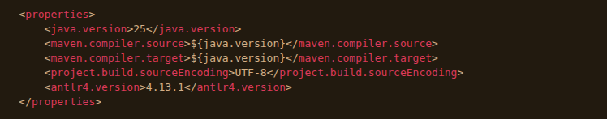

# Flink DSL

## Current State of Project

Currently the project can generate an end-to-end pipeline but it supports a minimal amount of the operations flink can do. 

## Usage of Visitor
The ANTLR visitor is used in [AstBuilder.java](src/main/java/com/flinkdsl/ast/AstBuilder.java), it extends the ANTLR visitor to walk the ANTLR parse tree and produce the typed AST.  

## Requirements

- Java 25 (JDK)
\
*might work with lower versions of java if you change it in pom.xml, I just used the one I had installed
You can change the version in the pom.xml here:


- Maven 3.x

## Installing required dependencies

No manual dependency installation is needed. Running `mvn package` will automatically download all required libraries (ANTLR4 runtime, Jackson, JUnit) from Maven Central on the first build.
\
*there might be some issues on mac with the pom.xml file, I built this using linux.

## Build

```bash
mvn package
```

Produces a fat jar at:

```
target/flink-dsl-0.1.0-SNAPSHOT-jar-with-dependencies.jar
```

## Run

### Generate a Flink job source file

```bash
java -jar target/flink-dsl-0.1.0-SNAPSHOT-jar-with-dependencies.jar <program.flink> [output-dir]
```

`output-dir` defaults to `./generated/` if omitted. Produces one `<PipelineName>Job.java` per pipeline.

**Examples:**
```bash
java -jar target/flink-dsl-0.1.0-SNAPSHOT-jar-with-dependencies.jar --run examples/temperature.flink examples/temperature_input.jsonl examples/temperature_output.jsonl
```

```bash
java -jar target/flink-dsl-0.1.0-SNAPSHOT-jar-with-dependencies.jar --run examples/orders.flink examples/orders_input.jsonl examples/orders_output.jsonl
```

```bash
java -jar target/flink-dsl-0.1.0-SNAPSHOT-jar-with-dependencies.jar --run examples/logins.flink examples/logins_input.jsonl examples/logins_output.jsonl
```

```bash
java -jar target/flink-dsl-0.1.0-SNAPSHOT-jar-with-dependencies.jar --run examples/metrics.flink examples/metrics_input.jsonl examples/metrics_output.jsonl
```